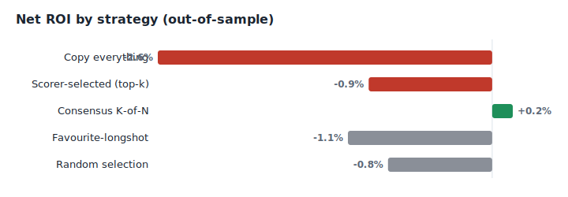

# Polywatch

**Does copying "smart money" on Polymarket actually make money? A measurement-first investigation.**

Polymarket settles on-chain, so every wallet's trades and realised profit are public. That makes a tempting question *empirically testable*: if you find the wallets that consistently win and copy their new bets, do you make money?

This repository is my attempt to answer that honestly — with out-of-sample validation, realistic costs, and statistical tests for overfitting — rather than with a backtest tuned until it looks good. The short version: **no, not after costs, and not from any wallet-selection rule I could find.** The rest of this README is how I got there, and the tooling I built along the way.

---

## TL;DR

- Built a loss-inclusive wallet scorer, a walk-forward validator, and arbitrage scanners for Polymarket and Kalshi.
- Tested the copy-trading thesis on **55,875 out-of-sample copied trades** across 2,561 wallets (scored from a 4,937-wallet pool).
- **Selecting wallets by past performance does not produce a real edge out-of-sample.** The scorer-selected strategy is statistically indistinguishable from zero (t = −0.39) and from random selection (−0.9% vs −0.8%), and it fails the Deflated Sharpe multiple-testing hurdle (DSR ≈ 0).
- After realistic slippage, broad copy-everything is **−2.6% / t = −3.76** (significantly negative) over 27k trades; even a K-of-N consensus only reaches break-even (+0.2%, t = +0.12 — noise).
- A short detour into arbitrage (internal Polymarket, then cross-platform Polymarket↔Kalshi) reached the same place: the genuinely-identical contracts have sub-cent gaps that fees erase.
- Conclusion: these markets are efficient enough that no easy, retail-runnable edge survives costs. The value here is the *method* — a framework that tells you that cheaply, before you risk money.

This matches what independent efforts find: e.g. Secuora's published research scored 49 well-known trading strategies over 127k trades and verified **zero** edges after fees. Honest backtesting tends to end this way; the point is to find out on paper.

---

## The question, precisely

"Smart-money copy-trading" is sold everywhere, but two things are usually skipped:

1. **Measuring skill correctly.** Polymarket's `/closed-positions` endpoint only returns *winning* positions, so naive win-rate is meaningless. You have to reconstruct each wallet's full, loss-inclusive P&L from its raw activity log.
2. **Validating out-of-sample.** Picking wallets *because* they won and then "discovering" that copying them wins is circular. The only honest test is to select on the past and measure on the future.

Polywatch does both, and treats the result as a hypothesis to be falsified, not a product to be shipped.

## Method

**Wallet scoring (`scorer.py`).** Reconstructs realised P&L per wallet from the full `/activity` log across the whole event vocabulary (BUY/SELL/REDEEM/SPLIT/MERGE), handling negRisk conversions (dropped, since they span multiple markets and can't be settled per-market), de-duplicating paginated overlap, and separating "profitable" (made money) from "predicted right" (the held side actually won at resolution). It flags two-sided / market-maker flow, which is not a copyable directional signal.

**Walk-forward validation (`walkforward.py`) — the core.** For each cutoff *T*:
- Score and rank wallets using only their trades up to *T*, and only markets that had **resolved by *T*** (so a training score can't peek at outcomes it couldn't have known). An optional embargo purges trades straddling the cutoff.
- Measure copy P&L only on the selected wallets' trades **after** *T*, against markets that have since resolved.
- Compare against two skill-free baselines the strategy must beat: a structural **favourite** (favourite-longshot) bet, and **random wallet selection**.
- Report per-trade *alpha vs price* (`outcome − entry`), a t-statistic, and the **Deflated Sharpe Ratio** (Bailey & López de Prado), which haircuts the Sharpe for the number of wallets tested — because the best of hundreds of noisy candidates looks good by chance.

The statistics (`stats.py`) are implemented from scratch (normal CDF/PPF, skew/kurtosis, PSR, expected-max-Sharpe, DSR) — no numpy/scipy — so every number is auditable.

**Costs (`costs.py`).** Slippage, fees, and a latency term are applied to every simulated copy. Copying is never free or instant; the gross-vs-net gap is where the thesis lives or dies.

## Results

<p align="center">
  
</p>

Out-of-sample, 2,561 wallets, 55,875 copied trades, 1% slippage, walk-forward across three cutoffs:

| Strategy (out-of-sample) | Trades | Net ROI | t-stat |
|---|---:|---:|---:|
| Copy everything | 27,462 | −2.6% | **−3.76** |
| Scorer-selected (top-k) | 2,540 | −0.9% | −0.39 |
| Consensus K-of-N | 8,021 | +0.2% | +0.12 |
| Favourite-longshot baseline | 16,561 | −1.1% | −2.27 |
| Random wallet selection | 1,291 | −0.8% | −0.24 |

Reading this honestly:

- The broad, well-powered strategy is **significantly negative** (copy-everything, t = −3.76), as is the favourite baseline (t = −2.27).
- **Selection doesn't create an edge.** Picking the top-scored wallets cuts the loss to −0.9%, but that is statistically indistinguishable from zero (t = −0.39) *and* from random selection (−0.8%), and it fails the Deflated Sharpe hurdle (DSR ≈ 0). Consensus reaches +0.2%, but t = +0.12 is pure noise.
- **By category the dispersion cancels out:** sports is significantly negative (−8.4%, t = −3.15), while politics prints +24.4% — but that is the best of six categories, with t = +2.69 (below the |t| > 3 bar multiple testing demands) on n = 407. One positive category out of six is expected by chance.

The full machine-generated table — every strategy variant, regenerable with one command — lives in [RESULTS.md](RESULTS.md). The chart above and an interactive HTML dashboard are produced by `polywatch report` (or `polywatch sweep --html report.html`), with no extra dependencies.

## Robustness: stress-testing the best-looking slice

The only result that looked like an edge — politics, where scorer-selection printed **+26.1% (t = +2.76)** on the discovery window — got a dedicated, pre-registered re-test. Re-run on a **fresh, earlier window it was never tuned on** (Nov 2025 – Feb 2026), the same politics-only strategy collapsed to **+0.3% (t = +0.07)** — statistically indistinguishable from zero.

| Politics-only, scorer-selected | OOS trades | Net ROI | t-stat |
|---|---:|---:|---:|
| Discovery window (Mar–May 2026) | 374 | +26.1% | +2.76 |
| Fresh hold-out (Nov 2025 – Feb 2026) | 600 | +0.3% | +0.07 |

The signal did not replicate. The tell was already in the baselines: copying *everything* in politics was +4.2% in-window and +3.7% out, both insignificant (t ≈ 1.4–1.5) — politics markets were simply up a little for buyers in both windows (favourites winning ~86%, the favourite-longshot pattern), and selection added nothing that survived a fresh window. A tempting +26% became nothing the moment it was tested out-of-sample, which is exactly what out-of-sample testing is for.

## The arbitrage detour

If you can't *predict*, maybe you can *arbitrage*. Two honest checks:

- **Internal Polymarket** (`arb.py`): scan for `ask(YES) + ask(NO) < $1` (a risk-free lock you can merge to cash). A 30-minute watch found **0 capturable gaps in 270 scans** — the order book is efficient, or the gaps vanish faster than a REST poller can see, i.e. an HFT game we can't win.
- **Cross-platform Polymarket ↔ Kalshi** (`crossarb.py`, `kalshi.py`): this is latency-tolerant, so it doesn't need a fast stack. The hard part is matching *genuinely identical* contracts; auto-matching titles mostly surfaces same-topic-different-contract traps (e.g. "win the nomination" vs "run for the nomination", or "win the governor race" vs "win the Senate race"). I verified one truly-identical pair with live prices — Beto O'Rourke as 2028 Democratic nominee, same resolution and date on both venues — and the arbitrage gap was **0.4¢ per $1, with capital locked until November 2028 and fees on both sides exceeding the gap.** Liquid markets are priced efficiently across venues; the illiquid ones with bigger "gaps" have no size to trade.

## Architecture

```
polywatch/
  polymarket.py   # read-only Polymarket client (Data, Gamma, CLOB), rate-limited + retrying
  kalshi.py       # read-only Kalshi client (public market data, category-filtered events)
  models.py       # pydantic models for trades, positions, markets
  scorer.py       # loss-inclusive wallet P&L reconstruction + informed-edge score
  walkforward.py  # out-of-sample walk-forward validation, baselines, verdict
  stats.py        # DSR / PSR / t-stat primitives, dependency-free
  backtest.py     # per-copy record producer (gross/net/alpha) shared by validation + baselines
  costs.py        # slippage / fee / latency cost model
  consensus.py    # K-of-N agreement gate
  categories.py   # keyword market categoriser
  arb.py          # internal Polymarket arbitrage scanner
  crossarb.py     # cross-platform Polymarket<->Kalshi scanner + candidate discovery
  sweep.py        # score every strategy variant into one results table (RESULTS.md)
  report.py       # self-contained HTML / SVG dashboard (no extra dependencies)
  cli.py          # command-line entry point
tests/            # 63 offline tests, no network required
```

Design choices worth noting: the scorer and validator share one per-trade record format, so the same code computes the strategy and its baselines (no accidental asymmetry); validation runs fully offline against a pre-resolved market cache (no per-wallet network calls); and the statistics are hand-rolled and unit-tested rather than imported, because the whole point is that the numbers are trustworthy.

## Install

```bash
git clone https://github.com/<you>/polywatch.git && cd polywatch
python -m venv .venv && source .venv/bin/activate   # Windows: .venv\Scripts\activate
pip install -e .                                    # installs the `polywatch` command
python -m pytest -q                                 # 63 tests, offline
```

Python 3.10+. Runtime dependencies: `httpx`, `pydantic`, `PyYAML` — no numpy/scipy.
`pip install -e .` adds a `polywatch` console command; everything also runs as
`python -m polywatch ...` without installing. Copy `config.example.yaml` to
`config.yaml` (and `.env.example` to `.env` if you want to override API endpoints).

## Usage

```bash
# Rank wallets by reconstructed, loss-inclusive P&L
python scripts/pick_wallets.py --markets 150 --max-candidates 400 --top 100 --write 100

# The core experiment: out-of-sample walk-forward validation, with a pass/fail verdict
python -m polywatch walkforward --cutoffs 2026-03-15 2026-04-15 2026-05-15 \
    --slippage 0.01 --top-k 50 --csv results.csv

# Score EVERY strategy variant (copy-all, selected, consensus, favourite, random)
# through one shared data pull -> writes RESULTS.md + results.csv
python -m polywatch sweep --cutoffs 2026-03-15 2026-04-15 2026-05-15 --slippage 0.01

# Same sweep, but also emit an interactive HTML dashboard + a README-ready SVG
python -m polywatch sweep --cutoffs 2026-03-15 2026-04-15 2026-05-15 --slippage 0.01 \
    --html report.html --svg docs/roi_by_strategy.svg
# ...or render the dashboard from an existing results.csv
python -m polywatch report --csv results.csv --html report.html

# Scan Polymarket for internal arbitrage (one shot, or --watch to measure gap lifetimes)
python -m polywatch arb --markets 200
python -m polywatch arb --markets 100 --watch 3 --duration 30 --csv gaps.csv

# Discover candidate Polymarket<->Kalshi pairs to verify by hand, then scan them
python -m polywatch crossarb --discover --out candidates.yaml
python -m polywatch crossarb --pairs pairs.yaml
```

`walkforward --csv` writes one row per copied trade (entry, outcome, net P&L, alpha, category, wallet) so the conclusions can be re-derived independently.

## Reproducing at scale

Polywatch reads only public on-chain data, so the dataset size is bounded by how
many wallets you scan and how deep their history goes — not by any private feed.
To run it at the scale of a published study, widen the pool and the history:

```bash
# 1. Assemble a large, unbiased candidate pool (fast; addresses only, unscored).
#    The walk-forward scores them point-in-time, so gathering broad avoids the
#    look-ahead bias of pre-selecting "winners".
python scripts/pick_wallets.py --markets 300 --max-candidates 5000 --gather-only

# 2. Sweep over deep history across several cutoffs.
python -m polywatch sweep --cutoffs 2026-03-15 2026-04-15 2026-05-15 \
    --top-k 100 --max-events 5000 --slippage 0.01 --html report.html
```

The out-of-sample trade count scales roughly with (pool size × history depth). Run
this on your own machine rather than a small VM — a multi-thousand-wallet history
reconstruction is memory-hungry. Every figure in `RESULTS.md` is produced this way
from real settlements; nothing is synthetic or hand-labelled, and wallets are
identified only by address (and, optionally, their own measured stats).

## Limitations

- The walk-forward uses market *end dates* as a proxy for resolution time, since Polymarket doesn't expose an exact resolution timestamp; a stricter purge would use on-chain settlement times.
- Validation is on resolved markets only — recent cutoffs leave little settled out-of-sample data, which is why the experiments use deeper history and earlier cutoffs.
- The cross-platform contract matcher is deliberately conservative and still needs a human to confirm identical resolution; it suggests candidates, it does not trade them.
- Everything is read-only. There is no live-execution code, by design: I wasn't going to build a fast execution stack for an edge I hadn't proven.

## What I take from it

The interesting result isn't "I built a bot." It's that a thesis which *sounds* obviously true — copy the proven winners — falls apart the moment it's tested out-of-sample with costs, and that this is the normal outcome rather than bad luck. Building the measurement was the point: walk-forward design, the Deflated Sharpe Ratio, honest baselines, and the discipline to publish a negative result instead of a curve-fit one. That's the part I'd want to be judged on.

## Disclaimer

Research and educational use only. Not financial advice. Prediction markets are restricted in some jurisdictions and most participants lose money. Nothing here places real orders.

MIT License.
